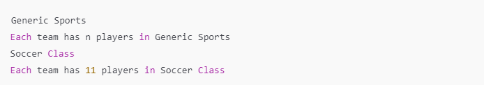

# O desafio trata de sobrescrever métodos em Java

Quando uma subclasse herda de uma superclasse, ela herda seus métodos, mas pode sobrescrevê-los para fornecer uma implementação específica.

## Contexto do Exemplo:
O documento fornece um exemplo com uma classe Sports que possui os métodos getName() e getNumberOfTeamMembers(). A classe Soccer, que herda de Sports, sobrescreve o método getName() para retornar a string "Soccer Class" em vez de "Generic Sports".

## Tarefa:
A sua tarefa é completar o código no editor, criando uma versão sobrescrita do método getNumberOfTeamMembers() na classe Soccer. Este método deve imprimir a mesma mensagem do método da superclasse, mas substituindo o valor n pelo número de jogadores em um time de futebol, que é "11".

## Formato de Saída Esperado:
Quando o código for executado, ele deve gerar a seguinte saída:

